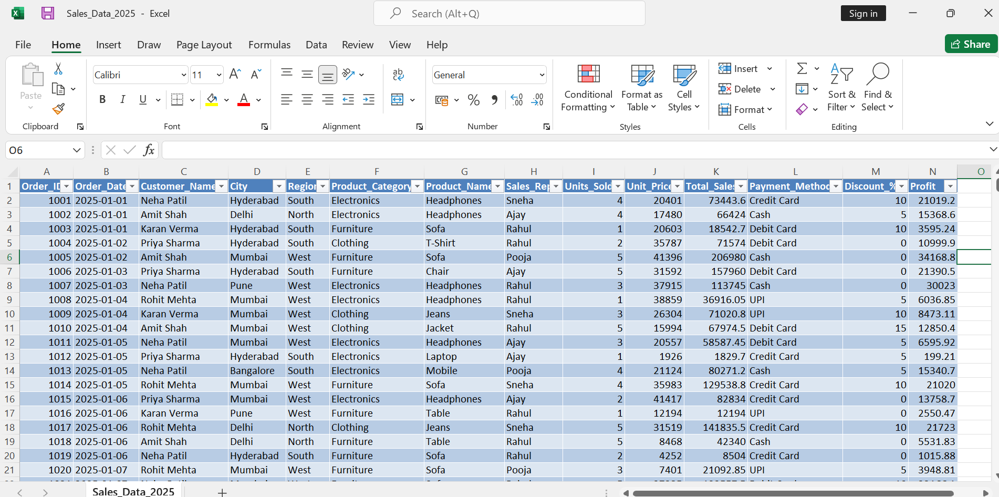
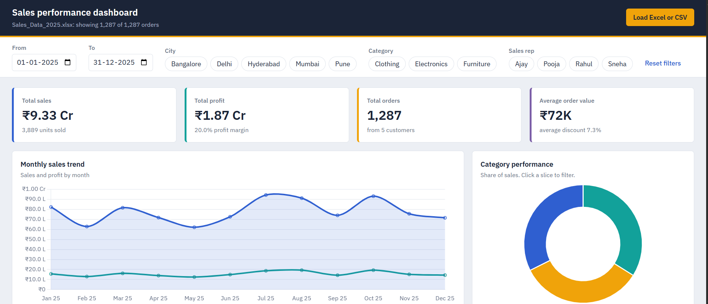
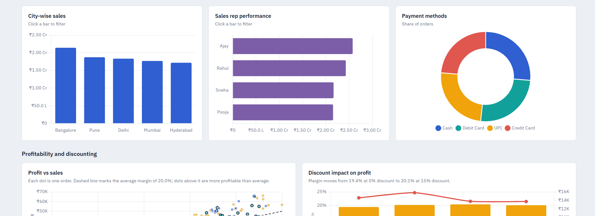
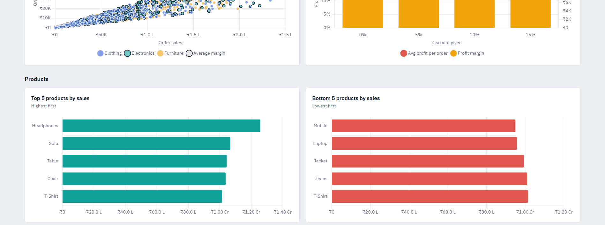

<div align="center">

# -- ! Sales Performance Dashboard 2025 ! --
### *Interactive, Excel-Powered Business Intelligence Dashboard in the Browser*

[](https://developer.mozilla.org/en-US/docs/Web/HTML)
[](https://developer.mozilla.org/en-US/docs/Web/CSS)
[](https://developer.mozilla.org/en-US/docs/Web/JavaScript)
[](https://www.chartjs.org/)
[](https://www.microsoft.com/en-in/microsoft-365/excel)

<br/>

> *"Data tells you what happened — a good dashboard shows you why it matters."*

</div>

---

## 📋 Table of Contents

- [📌 Overview](#-overview)
- [🎯 Problem Statement](#-problem-statement)
- [✨ Key Features](#-key-features)
- [🏗️ Project Structure](#️-project-structure)
- [🚀 How to Run](#-how-to-run)
- [🔄 Project Workflow](#-project-workflow)
- [📊 Part A — Data Loading and KPIs](#-part-a--data-loading-and-kpis)
- [📈 Part B — Visualizations and Insights](#-part-b--visualizations-and-insights)
- [🛠️ Tech Stack](#️-tech-stack)
- [📈 Results & Insights](#-results--insights)
- [🏆 Advantages](#-advantages)
- [📄 License](#-license)
- [👤 Author](#-author)
- [🙏 Acknowledgements](#-acknowledgements)

---

## 📌 Overview

The **Sales Performance Dashboard** is a modern, interactive, single-file web dashboard that turns a raw Excel sales sheet into a Power BI / Tableau-style business intelligence view. It loads **1,287 orders from 2025**, performs all aggregations in **JavaScript**, and redraws every KPI and chart instantly whenever a filter changes.

This project is designed to:
- Convert raw Excel sales data into clear, decision-ready visuals
- Track revenue, profit, order volume and average order value at a glance
- Compare performance across cities, categories, sales reps, products and payment methods
- Show how discounts affect profitability
- Run in any browser with no installation, server or build step

---

## 🎯 Problem Statement

> **Objective:** Build a fully functional, responsive, interactive dashboard from a sales dataset, with KPI cards, charts, advanced insights and slicers.

A sales team has a year of order data in Excel but no quick way to see which cities, products or sales reps drive results, or whether discounts are hurting profit. The dashboard must answer these questions visually and let the user slice the data by date, city, category and sales rep.

| 📂 Feature | 📄 Type | 🔍 Description |
|------------|---------|----------------|
| KPI Cards | Summary | Total Sales, Total Profit, Total Orders, Average Order Value |
| Trend Analysis | Line Chart | Monthly sales and profit across 2025 |
| Segment Analysis | Bar / Doughnut | City, category, sales rep and payment method breakdowns |
| Profitability | Scatter Plot | Profit vs sales for every order with an average-margin line |
| Discount Impact | Combo Chart | Profit margin and profit per order at each discount level |
| Product Ranking | Bar Chart | Top 5 and Bottom 5 products by sales |
| Slicers | Filters | Date range, City, Category, Sales Rep |

The goal is to demonstrate **practical data analysis and dashboard development skills** using only front-end technologies.

---

## ✨ Key Features

| Feature | Description |
|--------|-------------|
| 🧮 **4 KPI Cards** | Total Sales, Total Profit (with margin), Total Orders, Average Order Value |
| 📈 **9 Interactive Charts** | Trend, category, city, sales rep, payment, profit vs sales, discount impact, Top 5 and Bottom 5 products |
| 🎚️ **Dynamic Filters** | Date range plus clickable City, Category and Sales Rep chips |
| 🖱️ **Cross-Filtering** | Click a bar or doughnut slice in the City, Category or Sales Rep charts to filter everything else |
| 💬 **Rich Tooltips** | Hover any chart to see sales, profit, orders and margin; the scatter also shows product, city and discount |
| 📂 **Upload Your Own File** | "Load Excel or CSV" swaps in a new dataset and rebuilds all filters and charts |
| 📱 **Responsive Design** | Adapts from wide desktop screens to mobile with a sticky filter bar on large screens |
| ⚡ **Zero Setup** | One HTML file with the data embedded; just double-click to open |

---

## 🏗️ Project Structure

```
📦 sales-performance-dashboard/
│
├── 📄 sales_dashboard.html      ← Complete dashboard (HTML + CSS + JS, data embedded)
│
├── 📊 Sales_Data_2025.xlsx      ← Source dataset (1,287 orders, 14 columns)
│
├── 🖼️ images/
│   ├── Row-Data.png             ← Raw Excel data preview
│   ├── Sales-Dashboard.png      ← Filters, KPI cards, trend and category charts
│   ├── 1-Visualization.png      ← City, sales rep and payment charts
│   └── 2-Visualization.png      ← Profitability, discount and product charts
│
└── 📄 README.md                 ← Project documentation
```

---

## 🚀 How to Run

1. Download or clone this repository.
2. Open `sales_dashboard.html` in any modern browser (Chrome, Edge, Firefox, Safari).
3. Use the filters at the top to explore the data.
4. *(Optional)* Click **Load Excel or CSV** to analyze a different file. It must have the same column names as `Sales_Data_2025.xlsx`, with dates as `YYYY-MM-DD` or real Excel dates.

> 🌐 An internet connection is needed on first open because Chart.js, SheetJS and the IBM Plex Sans font load from a CDN.

---

## 🔄 Project Workflow

```
Open sales_dashboard.html
            │
            ▼
┌─────────────────────────────┐
│  Load Data                  │  ← Embedded 2025 data, or upload Excel / CSV
└────────────┬────────────────┘
             │
             ▼
┌─────────────────────────────┐
│  Clean and Normalize        │  ← Parse dates, convert numbers, drop invalid rows
└────────────┬────────────────┘
             │
             ▼
┌─────────────────────────────┐
│  Apply Filters              │  ← Date range, City, Category, Sales Rep
└────────────┬────────────────┘
             │
     ┌───────┴────────┐
     ▼                ▼
┌─────────────┐  ┌──────────────────┐
│ KPI Cards   │  │ Aggregations     │
│ Sales/Profit│  │ by month, city,  │
│ Orders/AOV  │  │ rep, product...  │
└──────┬──────┘  └────────┬─────────┘
       │                  │
       └────────┬─────────┘
                ▼
┌─────────────────────────────┐
│  Redraw All Charts          │  ← Tooltips and cross-filter clicks
└────────────┬────────────────┘
             │
             ▼
   Change a filter → repeat ✅
```

---

## 📊 Part A — Data Loading and KPIs

### 🗂️ 1. Dataset Overview

The dashboard is built on `Sales_Data_2025.xlsx`, a clean dataset with **no missing values**.

| Item | Detail |
|------|--------|
| 📅 Period | 1 Jan 2025 – 31 Dec 2025 |
| 🧾 Rows / Columns | 1,287 orders × 14 columns |
| 🏙️ Cities | Bangalore, Delhi, Hyderabad, Mumbai, Pune |
| 🗺️ Regions | North, South, West |
| 📦 Categories | Clothing, Electronics, Furniture |
| 🛍️ Products | 9 (Headphones, Laptop, Mobile, Sofa, Table, Chair, T-Shirt, Jeans, Jacket) |
| 🧑‍💼 Sales Reps | Ajay, Pooja, Rahul, Sneha |
| 💳 Payment Methods | Cash, Debit Card, UPI, Credit Card |
| 🏷️ Discount Levels | 0%, 5%, 10%, 15% |

| Column | Type | Description |
|--------|------|-------------|
| `Order_ID` | Integer | Unique order number |
| `Order_Date` | Date | Date of the order |
| `Customer_Name` | Text | Customer who placed the order |
| `City`, `Region` | Text | Where the order was placed |
| `Product_Category`, `Product_Name` | Text | What was sold |
| `Sales_Rep` | Text | Sales representative on the order |
| `Units_Sold`, `Unit_Price` | Number | Quantity and price per unit |
| `Total_Sales` | Number | Order revenue after discount |
| `Payment_Method` | Text | How the customer paid |
| `Discount_%` | Number | Discount given on the order |
| `Profit` | Number | Profit earned on the order |

<div align="center">



*Raw sales data in Excel — 1,287 rows across 14 columns*

</div>

---

### 🧮 2. KPI Cards and Filters

The top of the dashboard has the slicers and four KPI cards. All of them recalculate whenever a filter changes.

| KPI | How It Is Calculated |
|-----|----------------------|
| 💰 **Total Sales** | Sum of `Total_Sales` |
| 📈 **Total Profit** | Sum of `Profit`, shown with the overall profit margin |
| 🧾 **Total Orders** | Count of orders, shown with the number of customers |
| 🛒 **Average Order Value** | Total Sales ÷ Total Orders, shown with the average discount |

**Filter Logic:**
```javascript
const flt = skip => DATA.filter(r =>
  r.date >= from.value && r.date <= to.value &&
  K.every(k => k === skip || !S[k].size || S[k].has(r[k]))
);
```

<div align="center">



*Filters, KPI cards, monthly sales trend and category performance*

</div>

---

## 📈 Part B — Visualizations and Insights

### 🗺️ 3. Chart Overview

| Chart | Type | Question It Answers |
|-------|------|---------------------|
| 📅 Monthly Sales Trend | Line | How do sales and profit move month by month? |
| 🥧 Category Performance | Doughnut | Which category contributes the most sales? |
| 🏙️ City-wise Sales | Bar | Which cities sell the most? |
| 🧑‍💼 Sales Rep Performance | Horizontal Bar | Who are the top performers? |
| 💳 Payment Methods | Doughnut | How do customers prefer to pay? |
| 🎯 Profit vs Sales | Scatter | Which orders beat the average margin? |
| 🏷️ Discount Impact | Bar + Line | Do bigger discounts reduce profit? |
| 🏆 Top 5 / Bottom 5 Products | Horizontal Bar | Which products lead and lag? |

---

### 🏙️ 4. Cities, Sales Reps and Payment Methods

City and sales rep charts are clickable: selecting a bar filters the whole dashboard while the other bars stay visible but faded.

<div align="center">



*City-wise sales, sales rep performance and payment method distribution*

</div>

---

### 🎯 5. Profitability, Discounts and Products

The scatter plot draws one dot per order with a dashed average-margin line. The discount chart pairs profit margin (bars) with average profit per order (line). The product charts rank items by total sales.

<div align="center">



*Profit vs sales, discount impact on profit, and Top 5 / Bottom 5 products*

</div>

> ⚠️ **Note:** The dataset has only 9 products, so the Top 5 and Bottom 5 lists overlap (T-Shirt appears in both). With a larger product catalogue the two lists separate cleanly.

---

## 🛠️ Tech Stack

| Tool | Version | Purpose |
|------|---------|---------|
| 🌐 **HTML5** | — | Page structure and semantic layout |
| 🎨 **CSS3** | — | Grid layout, cards, responsive design |
| ⚙️ **JavaScript (ES6+)** | — | Data cleaning, filtering and all aggregations |
| 📊 **Chart.js** | 4.4.1 | Interactive charts and tooltips |
| 📗 **SheetJS (xlsx)** | 0.18.5 | Reading uploaded Excel and CSV files in the browser |
| 🔤 **IBM Plex Sans** | Google Fonts | Dashboard typography |
| 📁 **Microsoft Excel** | — | Source dataset |

---

## 📈 Results & Insights

Key findings from the 2025 data:

- 💰 **Total Sales of ₹9.33 Cr** and **Total Profit of ₹1.87 Cr**, a steady **20.0% profit margin**
- 🧾 **1,287 orders** from 5 customers, with an **average order value of about ₹72.5K** and **3,889 units sold**
- 🏙️ **Bangalore leads** with ₹2.14 Cr (276 orders); **Hyderabad is lowest** at ₹1.72 Cr and also has the lowest margin (19.2%)
- 🧑‍💼 **Ajay is the top sales rep** with ₹2.58 Cr, followed by Rahul (₹2.43 Cr), Sneha (₹2.17 Cr) and Pooja (₹2.16 Cr)
- 📦 **Categories are evenly balanced:** Electronics ₹3.16 Cr, Furniture ₹3.15 Cr, Clothing ₹3.02 Cr
- 🎧 **Headphones is the best-selling product** at ₹1.26 Cr, well ahead of Sofa (₹1.07 Cr); **Mobile is lowest** at ₹95 L
- 📅 **July is the peak month** (₹94.3 L) and **May the weakest** (₹62.1 L); sales also rise again in Aug and Oct
- 💳 **Payments are evenly split:** Cash 26.3%, Debit Card 25.5%, UPI 24.6%, Credit Card 23.6% of orders
- 🏷️ **Discounts do not erode margin in this data:** margin stays between 19.4% and 20.4% at every discount level. However, average profit per order is highest at 5% discount (₹15.8K) and drops to about ₹13.7K at 10% and 15%
- 🗺️ **Regional imbalance:** South (₹3.86 Cr) and West (₹3.64 Cr) each sell about twice as much as North (₹1.83 Cr), which is Delhi only

---

## 🏆 Advantages

| Advantage | Detail |
|-----------|--------|
| 🚀 **No Setup** | Single HTML file; runs by double-clicking, no server or build tools |
| ⚡ **Instant Updates** | Every chart and KPI redraws immediately when a filter changes |
| 🖱️ **Explorable** | Cross-filtering and detailed tooltips let users dig into the numbers |
| 📱 **Responsive** | Works on desktop, tablet and mobile screens |
| 🔁 **Reusable** | Upload any file with the same columns to get a fresh dashboard |
| 🧩 **Extensible** | Easy to add new charts, KPIs or filters in plain JavaScript |
| 📖 **Readable Code** | Small, well-separated functions for data, charts and rendering |
| 💸 **Free and Open** | Built only with free, open-source libraries |

---

## 📄 License

This project is licensed under the **MIT License** — see the [LICENSE](LICENSE) file for full details.

```
MIT License — Free to use, modify, and distribute with attribution.
```

---

## 👤 Author

<div align="center">

### Priya Shihora

[](https://github.com/priyashihora012)
[](https://www.linkedin.com/in/priya-shihora-b44349318)

> *"Every dashboard starts with a single question — and the right chart answers it at a glance."*

**🎓 Role:** Data Analyst | Dashboard Developer \
**📍 Location:** India\
**🛠️ Skills:** Excel · JavaScript · Chart.js · Data Analysis · Dashboard Design

</div>

---

## 🙏 Acknowledgements

Special thanks to the following resources and communities that made this project possible:

- 📊 [Chart.js Documentation](https://www.chartjs.org/docs/latest/) — Charting library reference
- 📗 [SheetJS Documentation](https://docs.sheetjs.com/) — Reading Excel files in the browser
- 🌐 [MDN Web Docs](https://developer.mozilla.org/) — HTML, CSS and JavaScript reference
- 🔤 [Google Fonts — IBM Plex Sans](https://fonts.google.com/specimen/IBM+Plex+Sans) — Dashboard typeface
- 🎨 [Shields.io](https://shields.io/) — README badges
- 💬 [Stack Overflow Community](https://stackoverflow.com/) — Problem-solving support

---

<div align="center">

---

*Made with ❤️ and ☕ — Last updated: 24 September, 2026*

</div>
