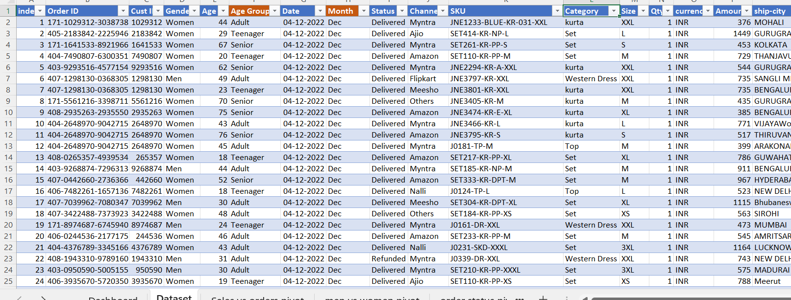
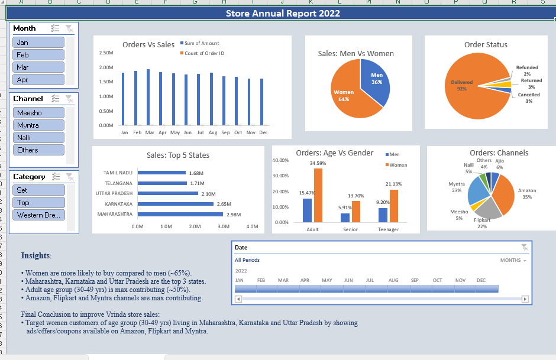

<div align="center">

# -- ! Vrinda Store Annual Sales Analysis 2022 ! --
### *Interactive Excel Dashboard for E-Commerce Sales, Customer and Channel Analysis*

[](https://www.microsoft.com/en-in/microsoft-365/excel)
[](https://support.microsoft.com/en-us/excel)
[](https://support.microsoft.com/en-us/excel)
[](https://support.microsoft.com/en-us/excel)

<br/>

> *"Numbers only become insights when someone asks the right question — and a dashboard answers it at a glance."*

</div>

---

## 📋 Table of Contents

- [📌 Overview](#-overview)
- [🎯 Problem Statement](#-problem-statement)
- [✨ Key Features](#-key-features)
- [🏗️ Project Structure](#️-project-structure)
- [🚀 How to Use](#-how-to-use)
- [🔄 Project Workflow](#-project-workflow)
- [📂 Part A — Data Preparation](#-part-a--data-preparation)
- [📊 Part B — Pivot Tables and Dashboard](#-part-b--pivot-tables-and-dashboard)
- [🛠️ Tech Stack](#️-tech-stack)
- [📈 Results & Insights](#-results--insights)
- [🏆 Advantages](#-advantages)
- [📄 License](#-license)
- [👤 Author](#-author)
- [🙏 Acknowledgements](#-acknowledgements)

---

## 📌 Overview

The **Vrinda Store Annual Sales Analysis** is an Excel-based data analysis project that turns **31,046 online order records from 2022** into a single interactive **Store Annual Report** dashboard. Using **Pivot Tables**, **Pivot Charts**, **Slicers** and a **Timeline**, it shows who buys, what they buy, where they live and which sales channel they use, then ends with a clear recommendation for growing the store's sales.

This project is designed to:
- Clean and organize raw e-commerce order data for analysis
- Summarize thousands of orders with Pivot Tables
- Present six key business views in one interactive dashboard
- Discover customer, location and channel patterns
- Convert findings into an actionable sales strategy

---

## 🎯 Problem Statement

> **Objective:** Analyze the 2022 sales data of Vrinda Store and recommend how to improve sales.

The store sells women's and men's ethnic and western wear (sets, kurtas, dresses, tops and more) across many online channels. Management needs to know which customers, states and channels bring the most revenue so that marketing effort can be focused where it matters.

| 📂 Question | 📄 Type | 🔍 Answered By |
|------------|---------|----------------|
| How do sales and orders change over the year? | Trend | Orders vs Sales column chart |
| Who buys more, men or women? | Comparison | Sales: Men vs Women pie chart |
| How many orders are delivered, returned or cancelled? | Status | Order Status pie chart |
| Which states generate the most sales? | Ranking | Top 5 States bar chart |
| Which age group and gender contribute most? | Segmentation | Orders: Age vs Gender column chart |
| Which channels bring the most orders? | Share | Orders: Channels pie chart |

The goal is to demonstrate **practical data analysis and dashboard design skills** in Microsoft Excel.

---

## ✨ Key Features

| Feature | Description |
|--------|-------------|
| 📊 **6 Interactive Charts** | Orders vs Sales, Men vs Women, Order Status, Top 5 States, Age vs Gender, Channels |
| 🎚️ **3 Slicers** | Filter the whole dashboard by Month, Channel and Category |
| 📅 **Date Timeline** | Slide across months to focus on any period of 2022 |
| 🧮 **6 Pivot Tables** | One dedicated pivot sheet powers each chart |
| 🗃️ **31,046 Records** | Large order-level dataset with 21 columns |
| 💡 **Built-in Insights** | Key findings and a final business conclusion written on the dashboard |
| 🎨 **Clean Layout** | Boxed sections, matching colours and a clear title banner |
| 🔄 **Refreshable** | Update the dataset, refresh the pivots and the dashboard updates |

---

## 🏗️ Project Structure

```
📦 store-sales-analysis/
│
├── 📊 Store_Data_Analysis.xlsx   ← Main workbook (8 sheets)
│
├── 🖼️ images/
│   ├── Dataset.png               ← Raw dataset preview
│   └── Dashboard.png             ← Final Store Annual Report dashboard
│
└── 📄 README.md                  ← Project documentation
```

**Workbook Sheets:**

| Sheet | Purpose |
|-------|---------|
| 🖥️ `Dashboard` | Final report with 6 charts, slicers, timeline and insights |
| 🗃️ `Dataset` | Source data (31,046 rows × 21 columns) |
| 📅 `Sales vs orders pivot` | Monthly sales amount and order count |
| 👫 `men vs women pivot` | Sales split by gender |
| 📦 `order status pivot` | Orders by delivery status |
| 🗺️ `Top States pivot` | Sales by shipping state |
| 🎂 `Age Vs Gender pivot` | Order share by age group and gender |
| 🛒 `channels pivot` | Order share by sales channel |

---

## 🚀 How to Use

1. Open `Store_Data_Analysis.xlsx` in **Microsoft Excel 2013 or later** (desktop app; slicers and timelines do not work in older versions).
2. Go to the **Dashboard** sheet.
3. Click any button in the **Month**, **Channel** or **Category** slicers. Hold `Ctrl` to select several.
4. Drag the **Date** timeline to focus on a range of months.
5. Click the small clear-filter icon (🧹) on a slicer to reset it.
6. To refresh after changing the data, go to **Data → Refresh All**.

---

## 🔄 Project Workflow

```
Raw Order Data (31,046 rows)
            │
            ▼
┌─────────────────────────────┐
│   Data Preparation          │  ← Age Group and Month columns, format checks
└────────────┬────────────────┘
             │
             ▼
┌─────────────────────────────┐
│   Create 6 Pivot Tables     │  ← Sales, orders, gender, status, state, age, channel
└────────────┬────────────────┘
             │
             ▼
┌─────────────────────────────┐
│   Build Pivot Charts        │  ← Column, pie and bar charts
└────────────┬────────────────┘
             │
             ▼
┌─────────────────────────────┐
│   Assemble Dashboard        │  ← Add slicers, timeline and layout
└────────────┬────────────────┘
             │
             ▼
┌─────────────────────────────┐
│   Insights and Conclusion   │  ← Who, where, and which channel to target
└────────────┬────────────────┘
             │
             ▼
     Interactive Store Annual Report ✅
```

---

## 📂 Part A — Data Preparation

### 🗂️ 1. Dataset Overview

The `Dataset` sheet holds one row per order line placed in 2022, with no missing values.

| Item | Detail |
|------|--------|
| 📅 Period | Jan 2022 – Dec 2022 |
| 🧾 Rows / Columns | 31,046 order lines × 21 columns |
| 🔢 Unique Order IDs | 28,470 (some orders contain several lines) |
| 👥 Customers | 28,436 unique customer IDs |
| 🧑‍🤝‍🧑 Gender | Women, Men |
| 🎂 Age Groups | Teenager (18–29), Adult (30–49), Senior (50–78) |
| 🛒 Channels | Amazon, Myntra, Flipkart, Ajio, Nalli, Meesho, Others |
| 👗 Categories | Set, Kurta, Western Dress, Top, Saree, Ethnic Dress, Blouse, Bottom |
| 📦 Order Status | Delivered, Returned, Cancelled, Refunded |
| 💱 Currency | INR (₹), shipped within India |

| Column | Description |
|--------|-------------|
| `index` | Row number |
| `Order ID`, `Cust ID` | Order and customer identifiers |
| `Gender`, `Age`, `Age Group` | Customer profile (Age Group is a derived column) |
| `Date`, `Month` | Order date and its month name (derived) |
| `Status` | Delivered, Returned, Cancelled or Refunded |
| `Channel` | Marketplace where the order was placed |
| `SKU`, `Category`, `Size` | Product details |
| `Qty`, `currency`, `Amount` | Quantity, currency and order value |
| `ship-city`, `ship-state`, `ship-postal-code`, `ship-country` | Delivery location |
| `B2B` | TRUE for business orders, FALSE for regular customers |

<div align="center">



*First rows of the Dataset sheet — 31,046 orders across 21 columns*

</div>

---

### 🧹 2. Data Quality Notes

A review of the dataset found a few small issues. They are minor and do **not** change any of the conclusions, but they are worth fixing when the data is refreshed.

| Issue | Detail |
|-------|--------|
| ✏️ **Corrupted state names** | 15 rows contain typos such as `MenAHARASHTRA`, `TAMenIL NADU`, `WomenEST BENGAL` and `ASSAMen` |
| 🔠 **Inconsistent capitalization** | Same state written several ways (e.g. `Delhi`, `DELHI`, `New Delhi`; `Punjab`, `PUNJAB`). There are 54 state labels for about 35 real states and union territories |
| 📏 **Invalid size** | 6 rows have `Men` in the `Size` column |
| ␣ **Trailing space** | The column header `Channel ` has an extra space at the end |

> ✅ **Impact check:** After correcting the state names, the Top 5 states and their order stay the same (Maharashtra, Karnataka, Uttar Pradesh, Telangana, Tamil Nadu). Only Maharashtra and Tamil Nadu change slightly.

---

## 📊 Part B — Pivot Tables and Dashboard

### 🧮 3. Pivot Tables and Charts

Each chart on the dashboard is driven by its own pivot table.

| Pivot Sheet | Values Used | Chart Type |
|-------------|-------------|------------|
| 📅 Sales vs orders | Sum of `Amount`, Count of `Order ID` by month | Clustered Column |
| 👫 Men vs women | Sum of `Amount` by gender | Pie |
| 📦 Order status | Count of `Order ID` by status | Pie |
| 🗺️ Top States | Sum of `Amount` by state (Top 5) | Horizontal Bar |
| 🎂 Age vs Gender | Count of `Order ID` as % of total, by age group and gender | Clustered Column |
| 🛒 Channels | Count of `Order ID` as % of total, by channel | Pie |

---

### 🖥️ 4. The Dashboard

The **Store Annual Report 2022** dashboard combines all six charts with three slicers (Month, Channel, Category) and a Date timeline. Clicking any slicer button updates every chart at once. The **Insights** box at the bottom summarizes the findings and the final recommendation.

<div align="center">



*Store Annual Report 2022 — six charts, slicers, timeline and business insights*

</div>

---

## 🛠️ Tech Stack

| Tool | Version | Purpose |
|------|---------|---------|
| 📗 **Microsoft Excel** | 2013 or later | Data storage, analysis and dashboard |
| 🧮 **PivotTables** | Built-in | Summarizing 31K+ rows quickly |
| 📊 **PivotCharts** | Built-in | Column, bar and pie charts linked to the pivots |
| 🎚️ **Slicers** | Excel 2010+ | Click-to-filter buttons for Month, Channel and Category |
| 📅 **Timeline** | Excel 2013+ | Visual date-range filter |
| 🎨 **Cell Formatting** | Built-in | Dashboard layout, banner and colours |

---

## 📈 Results & Insights

Key findings from the 2022 data:

- 💰 **Total sales of ₹2.12 Cr** (₹21,176,019) from **31,046 order lines**, with an average value of about **₹682** per line
- 👩 **Women drive the sales:** 64% of revenue (₹1.36 Cr) against 36% for men (₹76.1 L), and 69% of all orders come from women
- 👨 **Men spend more per order:** an average of ₹802 versus ₹629 for women
- 🗺️ **Top 3 states:** Maharashtra (₹29.8 L), Karnataka (₹26.5 L) and Uttar Pradesh (₹21.0 L), together **36.5% of all sales**. Telangana (₹17.1 L) and Tamil Nadu (₹16.8 L) complete the Top 5
- 🎂 **Adults (30–49 years) contribute about 50%** of sales, followed by teenagers (30%) and seniors (20%). Adult women alone place 34.6% of all orders
- 🛒 **Three channels dominate:** Amazon (35.5% of orders), Myntra (23.4%) and Flipkart (21.6%), about **80% combined**
- 👗 **Sets are the star category:** 49.6% of sales (₹1.05 Cr), followed by Kurta (23.4%) and Western Dress (14.9%)
- 📅 **Sales peak in March** (₹19.3 L, 2,819 orders) and **decline about 16% by November** (₹16.2 L)
- 📦 **92.3% of orders are delivered.** Returned (3.4%), Cancelled (2.7%) and Refunded (1.7%) orders together hold about **₹14.7 L (6.9%) of sales value**
- 🏢 **B2B is tiny:** only 186 order lines (about 0.6% of sales), so the store is almost entirely B2C

### 🎯 Final Conclusion

> **To improve Vrinda Store sales:** target **women customers aged 30–49 years living in Maharashtra, Karnataka and Uttar Pradesh** with ads, offers and coupons on **Amazon, Flipkart and Myntra**.

---

## 🏆 Advantages

| Advantage | Detail |
|-----------|--------|
| 🚫 **No Coding Needed** | Built entirely with standard Excel features |
| 🖱️ **Fully Interactive** | Slicers and timeline filter every chart in one click |
| 🔄 **Easy to Refresh** | Add new data, refresh the pivots and the dashboard updates |
| 📈 **Decision Ready** | Ends with a clear, actionable recommendation |
| 🗃️ **Handles Large Data** | Summarizes 31K+ rows instantly through pivots |
| 🧩 **Extensible** | New pivots, charts or slicers can be added in minutes |
| 📤 **Easy to Share** | One workbook file with data, pivots and dashboard together |
| 🎓 **Beginner Friendly** | A good showcase of core Excel analytics skills |

---

## 📄 License

This project is licensed under the **MIT License** — see the [LICENSE](LICENSE) file for full details.

```
MIT License — Free to use, modify, and distribute with attribution.
```

---

## 👤 Author

<div align="center">

### Priya Shihora

[](https://github.com/priyashihora012)
[](https://www.linkedin.com/in/priya-shihora-b44349318)

> *"Every dataset has a story — the job of an analyst is to find it and tell it clearly."*

**🎓 Role:** Data Analyst | Dashboard Developer \
**📍 Location:** India\
**🛠️ Skills:** Excel · Pivot Tables · Dashboards · Data Analysis · Business Insights

</div>

---

## 🙏 Acknowledgements

Special thanks to the following resources and communities that made this project possible:

- 📗 [Microsoft Excel Support](https://support.microsoft.com/en-us/excel) — Official Excel documentation
- 🧮 [Exceljet](https://exceljet.net/) — Excel formulas and pivot table guides
- 🎨 [Shields.io](https://shields.io/) — README badges
- 💬 [Stack Overflow Community](https://stackoverflow.com/) — Problem-solving support
- 📖 [Kaggle Learn](https://www.kaggle.com/learn) — Data analysis courses

---

<div align="center">

---

*Made with ❤️ and ☕ — Last updated: 24 September, 2026*

</div>
